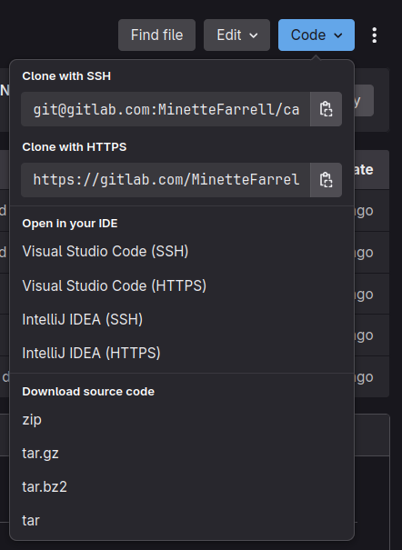
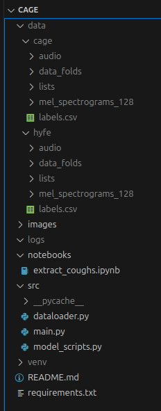

# Basic Framework for TB classification

## Datasets
* Download Cage and Hyfe datasets and unzip them in the "cage" folder.
* `mel_spectrograms_128` is a folder that contains each patient (`CAGE0001`) with all their extracted coughs as mel-spectrogram images saved as numpy files (`1.py, 2.py...17.npy`).
* `data_folds` contains the 10 folds used for cross-validation, where each fold is split per patient and contains all the coughs for the patients in that fold. 

## Setup
* Download WSL and open a WSL terminal.
* Clone the GitLab repository and go the the folder and open the folder.
    ```
    git clone https://gitlab.com/MinetteFarrell/cage.git
    cd cage
    code .
    ```
* For more information on cloning a repository using GitLab, go to this post: https://docs.gitlab.com/topics/git/clone/
* Otherwise, you can download and unzip the project from GitLab:

* Create and activate virtual environment called "venv". For more information on virtual environments go to this stack overflow post: https://stackoverflow.com/questions/41972261/what-is-a-virtualenv-and-why-should-i-use-one The main idea is that instead of downloading all the python packages globally on the machine, a small, light weight and easy to use python environment. All of the necessary packages are in the `requirements.txt` file.
    ```
    python3 -m venv venv
    source venv/bin/activate
    ```
* Install requirements:
    ``` 
    pip3 install -r requirements.txt 
    ```

## File structure:


## To run:
    ```
    source venv/bin/activate
    python3 src/main.py
    ```